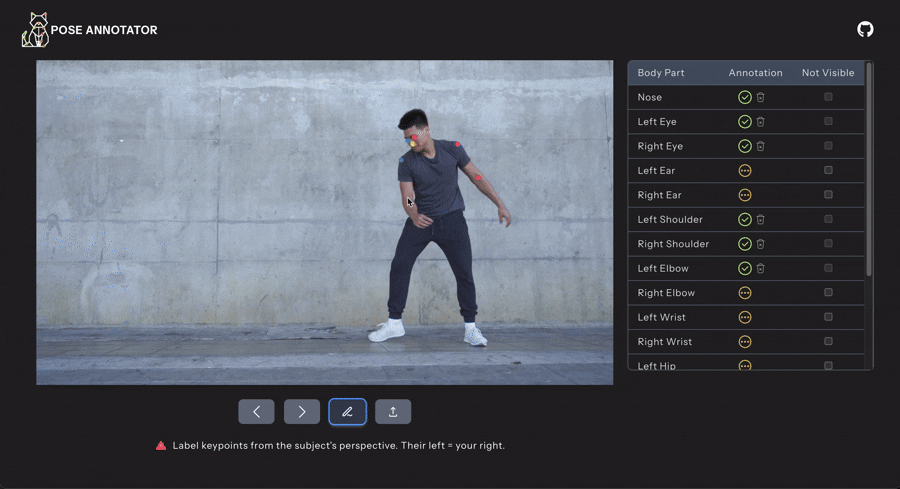

<div align="center">
  <picture>
    <source media="(prefers-color-scheme: dark)" srcset="frontend/src/assets/logo.png">
    <source media="(prefers-color-scheme: light)" srcset="frontend/src/assets/logo-light.png">
    
  </picture>

  <br>

  
  

  <br>

<i>A web-based keypoint annotation tool for human pose estimation</i>

</div>

<hr>

**Pose Annotator** is a lightweight, web-based tool for annotating
**keypoints** on video frames for human pose estimation.

### Key Features

- Upload a video and randomly sample a number of frames
- Step through sampled frames
- Annotate up to **17 COCO-format keypoints** via point-and-click
- Export frame annotations to a **CSV** file



<hr>

## Quick Start

### 1) Install Python 3.12+

If you don't have Python installed, download it from the official Python
website: https://www.python.org/downloads.

Verify your installed Python version from the command line:

**macOS / Linux**

```bash
python3 --version
```

**Windows**

```bat
py --version
```

### 2) Download Pose Annotator

1. Download the `pose-annotator-run-local.zip` from this repo.
2. Unzip it to your desired location on your computer.

### 3) Start Pose Annotator

**macOS** users should double-click on the `start.command` file.
**Windows** users should double-click on the `start.bat` file.

**Linux** users should run the following from their command line:

```bash
bash start.sh
```

Your browser should open automatically. If not, open your browser and
navigate to: http://localhost:8000
